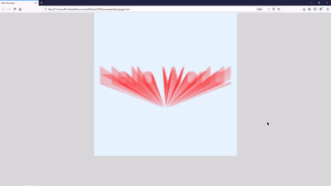
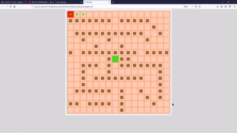

# JS2D
A small framework for making 2D Javascript games and animations. After using a lot of animation/game frameworks, I wanted to try my hand at making one myself. Thus JS2D was born. Currently its pretty bare bones, supporting a list of basic shape drawing functions, image i/0 functions, and couple useful data structures. 

### Basic Hello World Fun!

### Interactive A*

